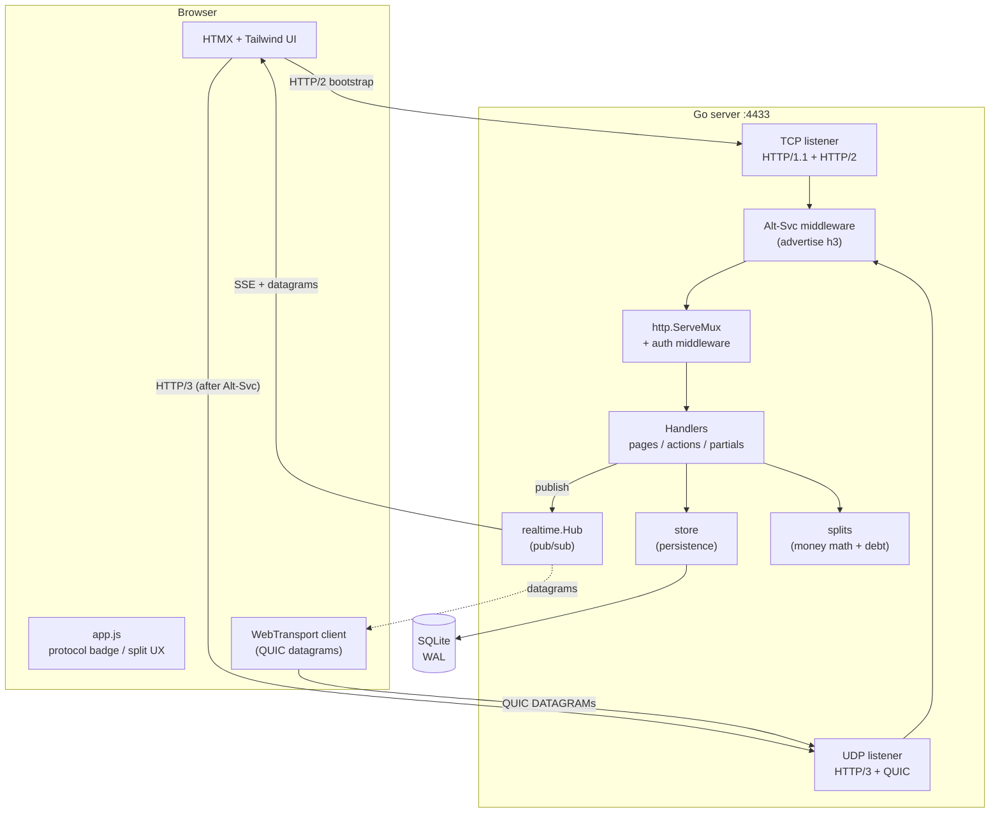

<div align="center">

#  Splitwise-QUIC

### A Splitwise clone that talks to your browser **entirely over HTTP/3 + QUIC**

Shared-expense tracking with real-time updates delivered as **QUIC DATAGRAM frames** over WebTransport.

<br/>


</div>

---

##  Table of contents

- [What is this?](#-what-is-this)
- [Highlights](#-highlights)
- [Architecture](#-architecture)
- [The QUIC techniques](#-the-quic-techniques)
- [Splitwise features](#-splitwise-features)
- [Quick start](#-quick-start)
- [Verifying HTTP/3](#-verifying-http3)
- [Project layout](#-project-layout)
- [How it works](#-how-it-works)
- [Configuration](#-configuration)
- [Testing](#-testing)
- [Design decisions](#-design-decisions)
- [Troubleshooting](#-troubleshooting)
- [Roadmap](#-roadmap)

---

##  What is this?

**Splitwise-QUIC** is a fully working [Splitwise](https://www.splitwise.com/)-style
expense splitter, built as a deliberate playground for the *complex* QUIC
techniques you rarely see wired together in one real application.

Your browser bootstraps over **HTTP/2 (TCP/TLS)**, reads the `Alt-Svc` header,
and transparently upgrades to **HTTP/3 over QUIC (UDP)** for every subsequent
request — both served on the same port. On top of that, live balance updates are
pushed to the browser as unreliable **QUIC DATAGRAM frames** via WebTransport,
with a graceful Server-Sent-Events fallback for non-Chromium browsers.

It's a real app (groups, multi-currency expenses, debt simplification, settle-up)
that happens to be an end-to-end QUIC showcase.

---

##  Highlights

| | |
|---|---|
|  **HTTP/3 first** | Every page and partial is served over QUIC; TCP exists only to bootstrap the upgrade. |
|  **Live over datagrams** | Real-time UI updates via QUIC DATAGRAMs (WebTransport) + SSE fallback. |
|  **Correct money math** | Integer minor units everywhere; zero lost pennies across any split. |
|  **4 split modes** | Equal, exact, percentage, and weighted shares. |
|  **Multi-currency** | Each currency's balances tracked and simplified independently. |
|  **Debt simplification** | Greedy cash-flow minimization — the same idea Splitwise ships. |
|  **Self-contained binary** | Templates + static assets embedded via `go:embed`; pure-Go SQLite (no cgo). |
|  **Zero-config TLS** | Fresh short-lived ECDSA cert minted on every boot for WebTransport cert-hash pinning. |

---

##  Architecture

> An interactive, zoomable version with multiple diagrams (system, request
> lifecycle, data model, QUIC handshake) lives in
> **[`docs/architecture.html`](docs/architecture.html)** — just open it in a browser.



---

##  The QUIC techniques

This project intentionally stacks the "hard" parts of QUIC into one app:

| Technique | Where it lives |
|---|---|
| **HTTP/3 over QUIC** (TLS 1.3 mandatory) | `internal/server/server.go` |
| **0-RTT** session resumption | `quic.Config{ Allow0RTT: true }` |
| **QUIC DATAGRAMs** (RFC 9221) | `EnableDatagrams: true` + WebTransport push |
| **WebTransport** live channel (browser) | `internal/handlers/realtime.go`, `static/app.js` |
| **Stream multiplexing** tuned high | `MaxIncomingStreams: 512` (no head-of-line blocking) |
| **Connection migration** friendliness | keep-alive + QUIC path validation |
| **Alt-Svc** TCP -> QUIC upgrade hint | `withAltSvc` middleware |
| **Mutual TLS** (optional) | `REQUIRE_MTLS=1` |
| Short-lived **ECDSA cert** for cert-hash pinning | `internal/server/tls.go` |

---

##  Splitwise features

- **Auth** — email/password with bcrypt hashing + opaque session cookies
- **Groups** — create groups, add members
- **Expenses** with four split modes:
  - **Equal** — divided evenly, leftover cents distributed deterministically
  - **Exact** — explicit amounts that must reconcile to the total
  - **Percentage** — basis-point precision, must total 100%
  - **Shares** — weighted (e.g. 2:1 => two-thirds / one-third)
- **Multi-currency** — balances computed per currency, never mixed
- **Debt simplification** — minimizes the number of "who pays whom" transfers
- **Settle-up** — record direct payments that clear balances
- **Activity feed** — human-readable audit trail per group
- **Real-time** — instant UI refresh via QUIC datagrams (WebTransport) or SSE

---

##  Quick start

**Prerequisites:** Go 1.26+

```bash
# from the project root
go run .
```

Then open **<https://localhost:4433>**.

> The dev server uses a **self-signed certificate**, so your browser will warn
> once. Accept it to proceed (a fresh cert is minted on every boot).

Build a binary instead:

```bash
go build -o splitwise-quic .
./splitwise-quic -addr :4433 -db splitwise.db
```

---

##  Verifying HTTP/3

Most system `curl` builds **don't** ship HTTP/3 support, so a tiny QUIC client is
bundled:

```bash
go run ./cmd/h3check https://localhost:4433/login
# -> OK over HTTP/3.0 -> 200 OK (3211 bytes)
```

Check the Alt-Svc upgrade hint over plain TCP:

```bash
curl -sk -D - -o /dev/null https://localhost:4433/login | grep -i alt-svc
# -> alt-svc: h3=":4433"; ma=2592000
```

In the browser, the green **`proto: h3`** badge in the header confirms you're on
HTTP/3, and the pulsing **live** dot on a group page confirms the WebTransport
datagram channel is connected.

---

##  Project layout

```
splitwise-quic/
├── main.go                  # entry point: flags, wiring, graceful shutdown
├── cmd/
│   └── h3check/             # standalone HTTP/3 client (smoke test)
├── internal/
│   ├── models/              # domain types (User, Group, Expense, ...)
│   ├── db/                  # SQLite connection + schema migration
│   ├── store/               # persistence (users, groups, expenses, balances)
│   ├── splits/              # PURE money math: split modes + debt simplification
│   ├── server/              # QUIC/HTTP3 transport, TLS, Alt-Svc, listeners
│   ├── realtime/            # in-memory pub/sub hub
│   ├── render/              # embedded templates (HTMX) + static assets (JS)
│   └── handlers/            # HTTP handlers, routing, SSE, WebTransport
├── docs/
│   └── architecture.html    # interactive Mermaid architecture diagrams
└── README.md
```

Every file is comfortably under 600 lines, and the `splits` package is **pure**
(no I/O) so the tricky money logic is trivially testable.

---

##  How it works

### The TCP -> QUIC upgrade dance

1. Browser makes its first request over **HTTP/2 (TCP/TLS)**.
2. Server responds with an **`Alt-Svc: h3=":4433"`** header.
3. Browser remembers this and uses **HTTP/3 over QUIC (UDP)** for subsequent
   requests — same port, different transport.

### Real-time updates (two channels)

- **WebTransport (fast lane):** `app.js` opens a WebTransport session pinned to
  the server's SHA-256 cert hash and reads **QUIC DATAGRAM** frames. Each event
  triggers an HTMX partial refresh.
- **SSE (fallback):** the page also subscribes via the HTMX SSE extension, so
  browsers without WebTransport still get live updates.

Both are fed by the same `realtime.Hub` — handlers `Publish` an event after any
mutation, and every subscriber (SSE stream or WT session) fans it out.

### Money, the right way

All amounts are stored as **integer minor units** (cents). Floating point only
appears at the input-parsing boundary. Splits distribute any rounding remainder
one cent at a time to the largest fractional parts — so shares **always** sum to
the exact total.

### Debt simplification

Net balances per currency feed a greedy **cash-flow minimization** heuristic:
repeatedly settle the biggest creditor against the biggest debtor. It produces
near-minimal transfers (the approach Splitwise itself uses).

---

##  Configuration

| Flag / Env | Default | Description |
|---|---|---|
| `-addr` | `:4433` | Listen address (used for **both** TCP and UDP) |
| `-db` | `splitwise.db` | SQLite database file path |
| `REQUIRE_MTLS` | _unset_ | Set to `1` to require mutual TLS (clients must present a cert) |

---

##  Testing

```bash
go test ./...        # split math + debt-simplification correctness
go vet ./...         # static analysis
```

The test suite covers the gnarly bits: equal-split penny distribution, exact-split
reconciliation, percentage basis points, weighted shares, and minimal transfers.

---

##  Design decisions

- **Pure-Go SQLite** (`modernc.org/sqlite`) — no cgo, so the build stays simple
  and cross-compilable. WAL mode + busy timeout keep concurrent QUIC streams from
  tripping over locks.
- **`go:embed` everything** — templates and static assets ship inside the binary;
  deploy a single file.
- **Short-lived ECDSA cert** — WebTransport's `serverCertificateHashes` only
  accepts ECDSA certs valid for <= 14 days, so a fresh 13-day cert is generated on
  every startup. No CA to install.
- **Manual `Alt-Svc` header** — set directly in middleware to avoid a
  listener-registration race in `quic-go`'s `SetQUICHeaders`.
- **Integer money** — floats are banned past the input boundary.

---

##  Troubleshooting

| Symptom | Cause / fix |
|---|---|
| Browser shows a cert warning | Expected — self-signed dev cert. Accept it once. |
| `proto: h2` instead of `h3` | First load is always HTTP/2; reload after the Alt-Svc header lands. |
| Live dot says "SSE fallback" | Your browser lacks WebTransport (Firefox/Safari). Updates still work via SSE. |
| `curl: option --http3 ...not support` | System curl has no HTTP/3. Use `go run ./cmd/h3check` instead. |
| Port already in use | Another instance is running: `pkill -f 'splitwise-quic -addr'`. |

---

##  Roadmap

- [ ] Expense editing & comments
- [ ] Receipt photo uploads (over QUIC streams)
- [ ] Per-user push notifications via datagrams
- [ ] CSV / PDF export
- [ ] Dockerfile + deployment manifest

---

<div align="center">

Built over QUIC, one penny at a time. 

</div>
